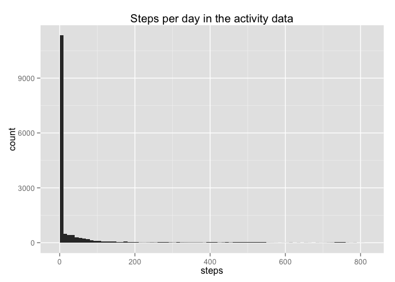
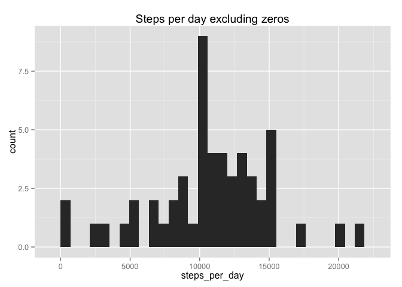

# Reproducible Research: Peer Assessment 1


## Loading and preprocessing the data
Set the working directory, read the zipped file, convert the dates to the proper format:

```r
setwd("~/Sync/Coursera/ReproResearch/RepData_PeerAssessment1")
activity <- read.csv(unzip("activity.zip", file="activity.csv"), header=TRUE, sep=",")
str(activity)
```

```
## 'data.frame':	17568 obs. of  3 variables:
##  $ steps   : int  NA NA NA NA NA NA NA NA NA NA ...
##  $ date    : Factor w/ 61 levels "2012-10-01","2012-10-02",..: 1 1 1 1 1 1 1 1 1 1 ...
##  $ interval: int  0 5 10 15 20 25 30 35 40 45 ...
```

```r
activity$date <- as.Date(activity$date)
summary(activity)
```

```
##      steps             date               interval     
##  Min.   :  0.00   Min.   :2012-10-01   Min.   :   0.0  
##  1st Qu.:  0.00   1st Qu.:2012-10-16   1st Qu.: 588.8  
##  Median :  0.00   Median :2012-10-31   Median :1177.5  
##  Mean   : 37.38   Mean   :2012-10-31   Mean   :1177.5  
##  3rd Qu.: 12.00   3rd Qu.:2012-11-15   3rd Qu.:1766.2  
##  Max.   :806.00   Max.   :2012-11-30   Max.   :2355.0  
##  NA's   :2304
```

## What is mean total number of steps taken per day?
Make a histogram of the steps per day, and find the mean and median:

```r
library(ggplot2)
ggplot(data=activity, aes(x=steps)) +
        geom_histogram(binwidth=10) +
        ggtitle("Steps per day in the activity data")
```

 

```r
ggplot(data=activity[activity$steps >0,], aes(x=steps)) +
        geom_histogram(binwidth=10) +
        ggtitle("Steps per day excluding zeros")
```

 

```r
steps.mean <- round(mean(activity$steps, na.rm=TRUE), 1)
steps.median <- median(activity$steps, na.rm=TRUE)
```
The mean number of steps is 37.4 
and the median number of steps is 0

## What is the average daily activity pattern?


## Imputing missing values


## Are there differences in activity patterns between weekdays and weekends?
