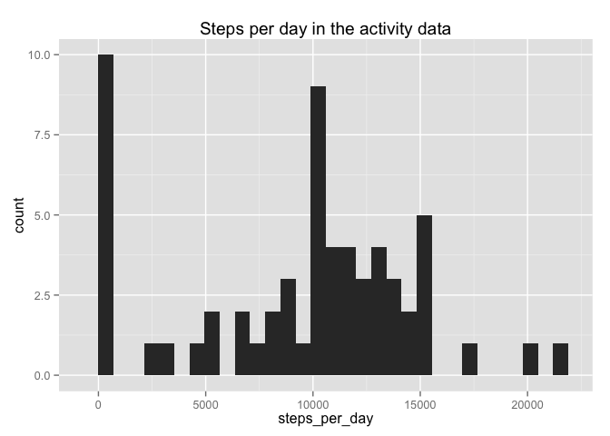

# Reproducible Research: Peer Assessment 1


## Loading and preprocessing the data
Set the working directory, read the zipped file, convert the dates to the proper format:

```r
options("scipen"=8)
setwd("~/Sync/Coursera/ReproResearch/RepData_PeerAssessment1")
activity <- read.csv(unzip("activity.zip", file="activity.csv"), header=TRUE, sep=",")
str(activity)
```

```
## 'data.frame':	17568 obs. of  3 variables:
##  $ steps   : int  NA NA NA NA NA NA NA NA NA NA ...
##  $ date    : Factor w/ 61 levels "2012-10-01","2012-10-02",..: 1 1 1 1 1 1 1 1 1 1 ...
##  $ interval: int  0 5 10 15 20 25 30 35 40 45 ...
```

```r
activity$date <- as.Date(activity$date)
summary(activity)
```

```
##      steps             date               interval     
##  Min.   :  0.00   Min.   :2012-10-01   Min.   :   0.0  
##  1st Qu.:  0.00   1st Qu.:2012-10-16   1st Qu.: 588.8  
##  Median :  0.00   Median :2012-10-31   Median :1177.5  
##  Mean   : 37.38   Mean   :2012-10-31   Mean   :1177.5  
##  3rd Qu.: 12.00   3rd Qu.:2012-11-15   3rd Qu.:1766.2  
##  Max.   :806.00   Max.   :2012-11-30   Max.   :2355.0  
##  NA's   :2304
```

## What is mean total number of steps taken per day?
1. Make a histogram of the steps per day, and find the mean and median:

```r
library(dplyr)
```

```
## 
## Attaching package: 'dplyr'
## 
## The following object is masked from 'package:stats':
## 
##     filter
## 
## The following objects are masked from 'package:base':
## 
##     intersect, setdiff, setequal, union
```

```r
stepsPerDay <- activity %>%
        group_by(date) %>%
        summarise(steps_per_day = sum(steps, na.rm=TRUE))

library(ggplot2)
ggplot(data=stepsPerDay, aes(x=steps_per_day)) +
        geom_histogram() +
        ggtitle("Steps per day in the activity data")
```

```
## stat_bin: binwidth defaulted to range/30. Use 'binwidth = x' to adjust this.
```

 

```r
steps.mean <- round(mean(stepsPerDay$steps_per_day, na.rm=TRUE))
steps.median <- median(stepsPerDay$steps_per_day, na.rm=TRUE)
```
2. The mean number of steps is 9354 
and the median number of steps is 10395.

## What is the average daily activity pattern?
1. Make a time series plot of the average number of steps over all days.  

```r
stepsByInterval <- activity %>%
        group_by(interval) %>%
        summarise(avg_steps_per_interval = mean(steps, na.rm=TRUE))

ggplot(data=stepsByInterval, aes(x=interval, y=avg_steps_per_interval)) +
        geom_line() +
        ggtitle("Average number of steps in each time interval")
```

 

```r
max_steps <- max(stepsByInterval$avg_steps_per_interval)
max_steps_interval <- with(stepsByInterval,
                        interval[avg_steps_per_interval==max_steps])
```
2. The maximum average number of steps in any time interval, 206, 
occured in the interval starting at 835.  

## Imputing missing values
1. Calculate the missing values in the activity dataset.

```r
n_missing <- sum(is.na(activity$steps))
```
There are 2304 missing values in the dataset.  
2. Impute missing values by filling in the mean value of steps for that interval.

```r
# Put the average number of steps per interval into the activity dataset
activity <- activity %>%
        mutate(
                avg_steps = rep(
                        stepsByInterval$avg_steps_per_interval, 
                                length(unique(activity$date))))

# if the number of steps is missing, impute the average number of steps
# rounded to the nearest whole number
activity <- activity %>%
        mutate(steps_imputed = ifelse(is.na(steps), 
                                      round(avg_steps), 
                                      steps))
```
3. Make a new dataset with the imputed values

```r
activity2 <- data.frame(steps=activity$steps_imputed, date=activity$date,
                        interval=activity$interval)
summary(activity2)
```

```
##      steps             date               interval     
##  Min.   :  0.00   Min.   :2012-10-01   Min.   :   0.0  
##  1st Qu.:  0.00   1st Qu.:2012-10-16   1st Qu.: 588.8  
##  Median :  0.00   Median :2012-10-31   Median :1177.5  
##  Mean   : 37.38   Mean   :2012-10-31   Mean   :1177.5  
##  3rd Qu.: 27.00   3rd Qu.:2012-11-15   3rd Qu.:1766.2  
##  Max.   :806.00   Max.   :2012-11-30   Max.   :2355.0
```
4. Redo the histogram and mean and median on this new dataset.

```r
stepsPerDay2 <- activity2 %>%
        group_by(date) %>%
        summarise(steps_per_day = sum(steps, na.rm=TRUE))

ggplot(data=stepsPerDay2, aes(x=steps_per_day)) +
        geom_histogram() +
        ggtitle("Steps per day in the revised activity data")
```

```
## stat_bin: binwidth defaulted to range/30. Use 'binwidth = x' to adjust this.
```

 

```r
steps.mean2 <- round(mean(stepsPerDay2$steps_per_day, na.rm=TRUE))
steps.median2 <- median(stepsPerDay2$steps_per_day, na.rm=TRUE)
```
The original mean number of steps is 9354 
and the original median number of steps is 10395.
The revised mean number of steps is 10766 
and the revised median number of steps is 10762.  

* Do these differ from the first step mean and median?  
        Yes, they do.  
* What is the impact of imputing missing data on these estimates?  
        The imputation has increase the mean more than it has increased the median.  

## Are there differences in activity patterns between weekdays and weekends?
1. Make a new factor that differentiates weekdays from weekends.

```r
weekend_days <- c("Saturday", "Sunday")
activity2$period <- ifelse(
                        weekdays(activity2$date) %in% weekend_days, "Weekend", "Weekday")
```
2. Make a panel plot that compares average steps on weekends vs. weekdays.  

```r
stepsByInterval2 <- activity2 %>%
        group_by(interval, period) %>%
        summarise(avg_steps_per_interval = mean(steps, na.rm=TRUE))

ggplot(data=stepsByInterval2, aes(x=interval, y=avg_steps_per_interval, colour=period)) +
        geom_line() +
        facet_grid(period ~ .) +
        xlab("Interval") +
        ylab("Number of Steps") +
        ggtitle("Average number of steps in each time interval (revised)")
```

 
